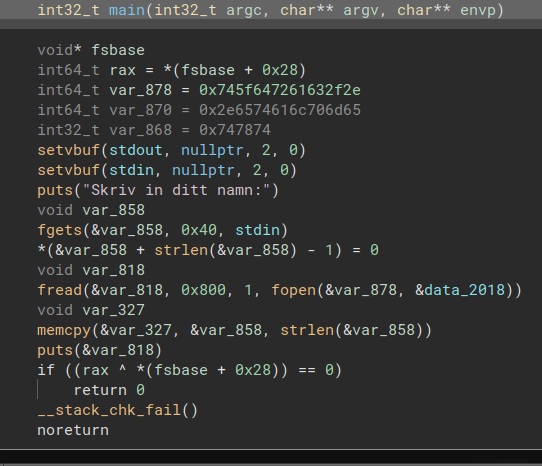
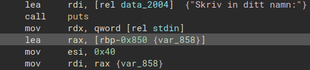
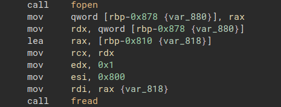
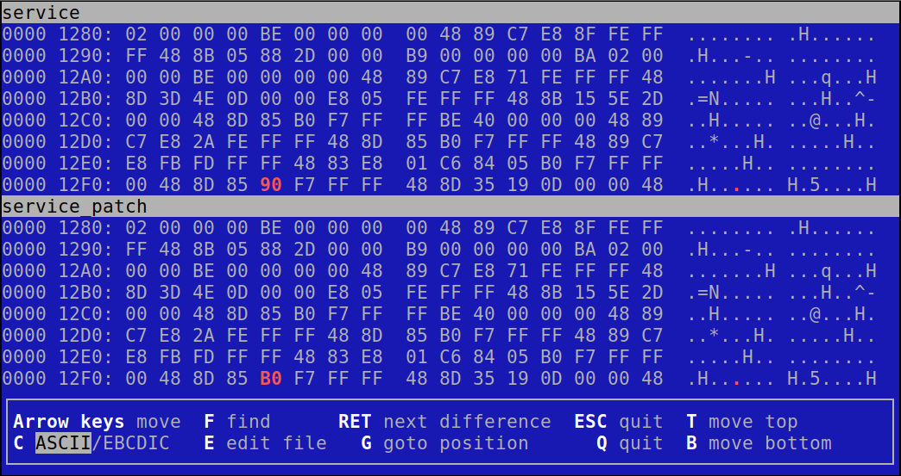

# Julkortsgenerator write-up
<b>Julkortsgenerator</b> was a 350-point pwn challenge in the SSM 2023 qualifiers. All that was included in the challenge was an executable and a server to connect to.

## Description
> Gör dina julkort här! Generatorn ska vara säker by default, men du får ändra på en byte i den innan den körs!
Flaggan ligger i /flag.txt.

**Author** Mateusz Drwal<br>
**Files** service<br>
**Service** nc <s>35.217.51.10</s> 50000<br>
**Unofficial difficulty** Medium - Hard

Note that all online services have been brought offline, but it is still possible to try the challenges using Docker <a href="https://github.com/Kodsport/sakerhetssm-2023-solutions/">here</a>.
## Introduction
Before investigating the internals of the given file, let's open it and see what it does.
```
$ nc localhost 50000
Vilken byte vill du patcha? (i hex)
> AB
Vad vill du patcha den till? (i hex)
> CD
Här kommer den patchade binären:
Skriv in ditt namn:
> Cranjis McBasketball
┏━━━━━━━━━━━━━━━━━━━━━━━━━━━━━━━━━━━━━━━━━━━━━━━━━━━━━━━━━━━━━━┓
┃                                                              ┃
┃   ██████╗  ██████╗ ██████╗          ██╗██╗   ██╗██╗     ██╗  ┃
┃  ██╔════╝ ██╔═══██╗██╔══██╗         ██║██║   ██║██║     ██║  ┃
┃  ██║  ███╗██║   ██║██║  ██║         ██║██║   ██║██║     ██║  ┃
┃  ██║   ██║██║   ██║██║  ██║    ██   ██║██║   ██║██║     ╚═╝  ┃
┃  ╚██████╔╝╚██████╔╝██████╔╝    ╚█████╔╝╚██████╔╝███████╗██╗  ┃
┃   ╚═════╝  ╚═════╝ ╚═════╝      ╚════╝  ╚═════╝ ╚══════╝╚═╝  ┃
┃                                                              ┃
┃                   önskar Cranjis McBasketball                ┃ 
┃                                                              ┃
┗━━━━━━━━━━━━━━━━━━━━━━━━━━━━━━━━━━━━━━━━━━━━━━━━━━━━━━━━━━━━━━┛
```
How lovely! It seems that the program generates Christmas cards with your name on it. However, before being prompted with your name, it instructs us to select a single byte in the application to patch. In this case, the patch didn't affect the program, but after some toying around, it's not uncommon to be greeted with SIGSEVs.
## Analysis
Let's begin with opening the binary in Binary Ninja to further our understanding of how this works. Ignoring standard library function, we see that the **service** contains only a `main` function. It reads 40 bytes from `stdin`, storing it in `var_858`. Later, the binary calls `fread` and `fopen`, obvious suspects for potential attack vectors. `fopen` seems to point to a character array with the hard-coded value of `./card_template.txt`. Wouldn't it be something if we could change that to point to `flag.txt`?
</img><br>
</img>
<br>Name string<br>
</img>
<br>`fread` parameters showing pointer to the constant string in `fopen`.
### Patching
The rules have been established. You're only allowed to patch a single byte. That eliminates the possibility of manipulating the string `./card_template.txt`. Let's take a look at the assembly. Binary Ninja has been so kind to label the variables for us. From the get-go, it's possible to deduce that the user-supplied name is at an offset of `-850` bytes from the base pointer. Moving on to the string holding `./card_template.txt`, that has an offset of `-870` bytes from `rbp`. Now, let's try changing the pointer in `fopen` to the user-supplied input. To do this, simply change the offset from `-870` to `-850`. I'll save this as `service_patch`.

```
$ ./service_patch
Skriv in ditt namn:
> test.txt
This is a test!
```
The patch seems to work, we're almost done. Using a utility such as vbindiff, we can compare differences in two binaries. Let's try it with the patched version and the original.
```
$ vbindiff service service_patch
```
</img>
`vbindiff` indicates a one byte difference between the two. The fourth byte at address `0x12F0` has been changed from `0x90` to `0xB0`. Jackpot! Let's plop those values in and see what we get.
```
$ nc localhost 5000
Vilken byte vill du patcha? (i hex)
> 12F4
Vad vill du patcha den till? (i hex)
> B0
Här kommer den patchade binären:
Skriv in ditt namn:
> /flag.txt
SSM{m1n1m4l15715k_p47chn1n6}
```
## Closing remarks
All in all, this challenge was a blast. A common pitfall is forgetting the slash in `/flag.txt`. I thought this challenge contained a perfect blend between pwn and reverse engineering. 
